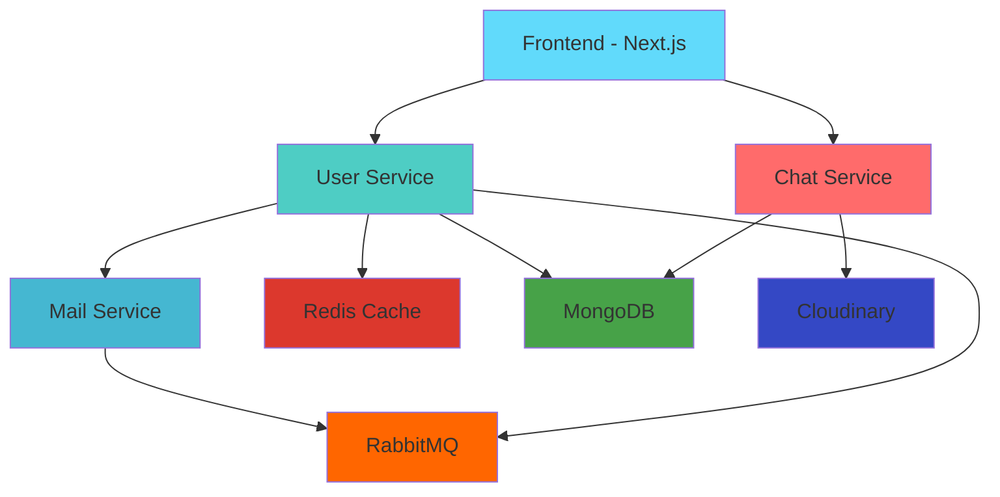
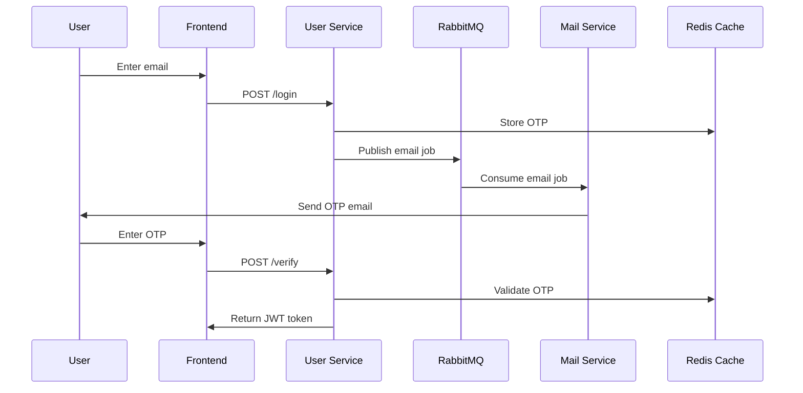
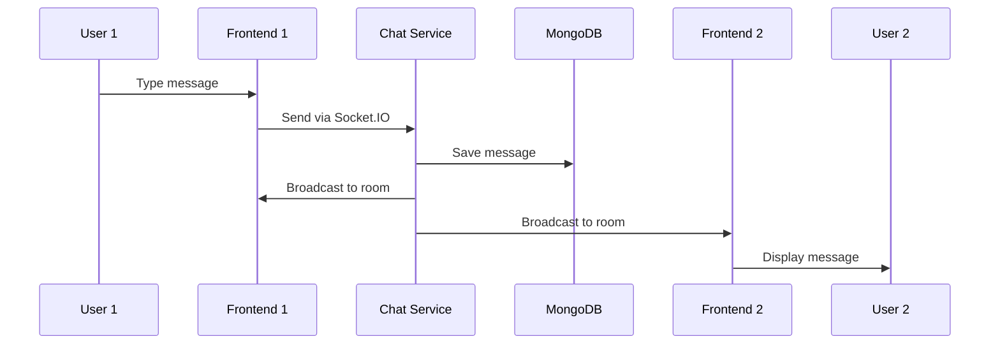

# 💬 Pulse Chat App

<div align="center">
  
  
  
  
  
  
  
</div>

<div align="center">
  <h3>A modern, real-time chat application built with microservices architecture</h3>
  <p>Featuring real-time messaging, emoji reactions, file sharing, video calling, and secure email-based authentication</p>
</div>

---

## 🌟 **Live Demo**

- **🌐 Frontend**: [https://the-pulse-chat-app.vercel.app](https://the-pulse-chat-app.vercel.app)
- **🔑 Demo Account**: `dummy@gmail.com` | OTP: `123456`

---

## ✨ **Features**

### 💬 **Real-time Messaging**
- ⚡ Instant messaging with WebSocket connections
- 📝 Support for text messages, images, replies, and forwards
- 😊 Message reactions with emoji picker
- ✍️ Typing indicators and online/offline status
- 👀 Read receipts and message seen status
- 🗑️ Message deletion with soft delete

### 🔐 **Authentication System**
- 📧 Email-based OTP authentication (passwordless)
- 🔑 JWT token management with 15-day expiration
- 🚦 Rate limiting on OTP requests
- 🎭 Auto-generated avatars for new users
- 🔒 Secure session management with Redis

### 📱 **Modern UI/UX**
- 🎨 Responsive design with Tailwind CSS
- 🌙 Dark theme with gradient backgrounds
- 📱 Mobile-optimized with touch interactions
- ✨ Smooth animations with Framer Motion
- 🖼️ Image upload with preview and optimization


---

## 🏗️ **Architecture**

### **Microservices Design**



### **Service Breakdown**

| Service | Technology | Purpose |
|---------|------------|---------|
| **Frontend** | Next.js 15 + React 19 | User interface and real-time interactions |
| **Chat Service** | Express + Socket.IO | Real-time messaging and file uploads |
| **User Service** | Express + JWT + Redis | Authentication and user management |
| **Mail Service** | Nodemailer + RabbitMQ | Asynchronous email delivery |

---

## 🚀 **Quick Start**

### **Prerequisites**
- Node.js 18+ 
- MongoDB
- Redis
- RabbitMQ (or CloudAMQP account)
- Cloudinary account
- Gmail account for SMTP

### **Installation**

1. **Clone the repository**
   ```bash
   git clone https://github.com/yourusername/pulse-chat-app.git
   cd pulse-chat-app
   ```

2. **Install dependencies**
   ```bash
   npm install
   ```

3. **Environment Setup**
   
   Create `.env` files for each service:

   **Backend/Chat/.env**
   ```env
   PORT=5002
   MONGO_URI=mongodb://localhost:27017/chatapp
   JWT_SECRET=your_jwt_secret_here
   USER_SERVICE=http://localhost:5000
   Cloud_Name=your_cloudinary_name
   Api_Key=your_cloudinary_key
   Api_Secret=your_cloudinary_secret
   ```

   **Backend/User/.env**
   ```env
   PORT=5000
   MONGO_URI=mongodb://localhost:27017/chatapp
   JWT_SECRET=your_jwt_secret_here
   REDIS_URL=redis://localhost:6379
   CLOUDAMQP_URL=amqp://localhost:5672
   ```

   **Backend/Mail/.env**
   ```env
   PORT=5001
   CLOUDAMQP_URL=amqp://localhost:5672
   EMAIL_USER=your_gmail@gmail.com
   EMAIL_PASSWORD=your_app_password
   ```

4. **Start all services**
   ```bash
   npm run dev
   ```

   Or start individual services:
   ```bash
   # Frontend (port 3000)
   cd frontend && npm run dev

   # Chat Service (port 5002)
   cd backend/chat && npm run dev

   # User Service (port 5000)
   cd backend/user && npm run dev

   # Mail Service (port 5001)
   cd backend/mail && npm run dev
   ```

---

## 🛠️ **Technology Stack**

### **Frontend**
- **Framework**: Next.js 15 with React 19
- **Language**: TypeScript
- **Styling**: Tailwind CSS 4.x
- **State Management**: React Context API
- **Real-time**: Socket.IO Client
- **HTTP Client**: Axios
- **Authentication**: JWT + js-cookie
- **Animations**: Framer Motion

### **Backend Services**
- **Runtime**: Node.js with TypeScript (ES Modules)
- **Framework**: Express 5.x
- **Database**: MongoDB with Mongoose
- **Cache**: Redis 5.x
- **Queue**: RabbitMQ (amqplib)
- **Real-time**: Socket.IO 4.8.x
- **File Storage**: Cloudinary
- **Email**: Nodemailer with Gmail SMTP
- **Authentication**: JWT

---

## 📁 **Project Structure**

```
pulse-chat-app/
├── 📁 frontend/                    # Next.js 15 Application
│   ├── 📁 src/
│   │   ├── 📁 app/                 # Next.js App Router
│   │   │   ├── 📁 chat/            # Main chat interface
│   │   │   ├── 📁 login/           # Authentication pages
│   │   │   ├── 📁 verify/          # OTP verification
│   │   │   └── 📁 profile/         # User settings
│   │   ├── 📁 components/          # Reusable React components
│   │   │   ├── 📄 ChatMessages.tsx
│   │   │   ├── 📄 MessageInput.tsx
│   │   │   ├── 📄 ChatSidebar.tsx
│   │   │   └── 📄 ReactionPicker.tsx
│   │   └── 📁 context/             # React Context providers
│   │       ├── 📄 AppContext.tsx   # Global app state
│   │       └── 📄 SocketContext.tsx # Socket.IO management
├── 📁 backend/
│   ├── 📁 chat/                    # Real-time messaging service
│   │   ├── 📁 src/
│   │   │   ├── 📁 config/          # Configuration files
│   │   │   ├── 📁 controllers/     # Business logic
│   │   │   ├── 📁 models/          # MongoDB schemas
│   │   │   ├── 📁 routes/          # Express routes
│   │   │   └── 📁 middlewares/     # Authentication & validation
│   ├── 📁 user/                    # Authentication service
│   │   ├── 📁 src/
│   │   │   ├── 📁 config/          # DB, Redis, RabbitMQ setup
│   │   │   ├── 📁 controllers/     # Auth logic
│   │   │   ├── 📁 model/           # User schema
│   │   │   └── 📁 routes/          # User routes
│   └── 📁 mail/                    # Email service
│       └── 📁 src/
│           ├── 📄 consumer.ts      # RabbitMQ consumer
│           └── 📄 index.ts         # Service entry point
├── 📄 package.json                # Root package configuration
├── 📄 WARP.md                     # Development guide
└── 📄 README.md                   # This file
```

---

## 🔄 **Data Flow**

### **Authentication Flow**


### **Real-time Messaging Flow**


---

## 🌐 **API Documentation**

### **User Service Endpoints**
| Method | Endpoint | Description |
|--------|----------|-------------|
| `POST` | `/api/v1/login` | Send OTP to email |
| `POST` | `/api/v1/verify` | Verify OTP and login |
| `GET` | `/api/v1/me` | Get current user |
| `GET` | `/api/v1/user/all` | Get all users |
| `PUT` | `/api/v1/update-profile-pic` | Update profile picture |

### **Chat Service Endpoints**
| Method | Endpoint | Description |
|--------|----------|-------------|
| `POST` | `/api/v1/chat/new` | Create new chat |
| `GET` | `/api/v1/chat/all` | Get user's chats |
| `POST` | `/api/v1/message` | Send message |
| `GET` | `/api/v1/message/:chatId` | Get chat messages |
| `POST` | `/api/v1/message/reaction` | Add reaction |
| `DELETE` | `/api/v1/messages/:messageId` | Delete message |

### **Socket.IO Events**
| Event | Description |
|-------|-------------|
| `newMessage` | New message received |
| `messageReaction` | Message reaction added |
| `messageDeleted` | Message deleted |
| `typing` | User is typing |
| `userTyping` | Show typing indicator |
| `getOnlineUser` | Online users list |

---

## 🔧 **Development**

### **Development Commands**
```bash
# Start all services concurrently
npm run dev

# Build all services
npm run build

# Start production build
npm start

# Lint frontend code
cd frontend && npm run lint
```

### **TypeScript Configuration**
- **Backend**: ES2020 target, NodeNext modules
- **Frontend**: ES2017 target, Next.js integration
- **Path aliases**: `@/*` for frontend imports

### **Database Schemas**

**User Schema**
```typescript
interface IUser {
  name: string;
  email: string;
  profilePic?: string;
}
```

**Chat Schema**
```typescript
interface IChat {
  users: string[];
  latestMessage: {
    text: string;
    sender: string;
  };
}
```

**Message Schema**
```typescript
interface IMessage {
  chatId: ObjectId;
  sender: string;
  text?: string;
  image?: { url: string; publicId: string };
  messageType: "text" | "image" | "deleted" | "reply" | "forward";
  reactions?: { userId: string; emoji: string }[];
  repliedMessage?: object;
}
```

---

## 🚀 **Deployment**

### **Production Deployment**
The application is deployed across multiple platforms:

- **Frontend**: Deployed on [Vercel](https://vercel.com)
- **Backend Services**: Deployed on [Render.com](https://render.com)
- **Database**: MongoDB Atlas
- **Cache**: Redis Cloud
- **Queue**: CloudAMQP
- **File Storage**: Cloudinary

### **Environment Variables**
Make sure to set up all required environment variables in your deployment platform:

- Database URLs (MongoDB, Redis)
- API keys (Cloudinary, JWT secret)
- Service URLs for inter-service communication
- Email credentials for SMTP

---

## 🤝 **Contributing**

1. Fork the repository
2. Create a feature branch (`git checkout -b feature/amazing-feature`)
3. Commit your changes (`git commit -m 'Add amazing feature'`)
4. Push to the branch (`git push origin feature/amazing-feature`)
5. Open a Pull Request

### **Development Guidelines**
- Follow TypeScript best practices
- Use ESLint and Prettier for code formatting
- Write meaningful commit messages
- Test your changes thoroughly
- Update documentation as needed

---

## 📝 **License**

This project is licensed under the ISC License. See the [LICENSE](LICENSE) file for details.

---

## 👨‍💻 **Author**

**Your Name**
- GitHub: [@manas200](https://github.com/manas200)
- LinkedIn: [Manas Chaturvedi](https://www.linkedin.com/in/manas-chaturvedi-a38229190/)
- Email: manasc2009@gmail.com

---

## 🙏 **Acknowledgments**

- [Next.js](https://nextjs.org/) for the amazing React framework
- [Socket.IO](https://socket.io/) for real-time communication
- [Tailwind CSS](https://tailwindcss.com/) for utility-first styling
- [MongoDB](https://mongodb.com/) for the flexible database
- [Cloudinary](https://cloudinary.com/) for image management

---

## 📊 **Project Stats**

<div align="center">
  
  
  
  
</div>

---

<div align="center">
  <h3>⭐ Star this repo if you found it helpful!</h3>
  <p>Made with ❤️ and lots of ☕</p>
</div>


